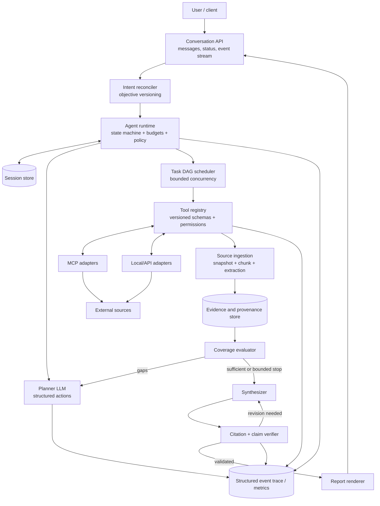
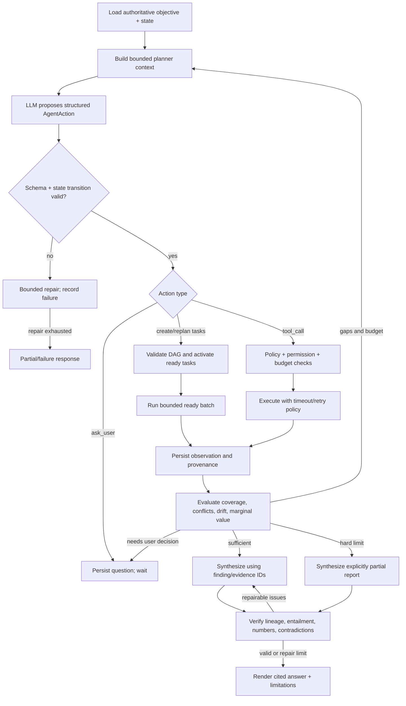
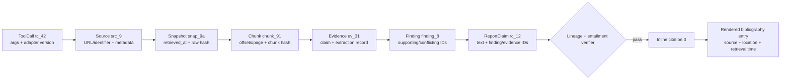
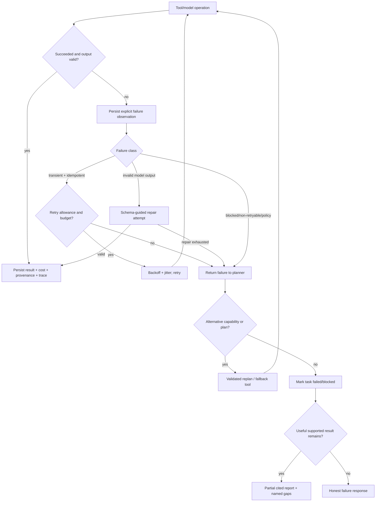

# General-Purpose Research Agent — System Design

## 1. Executive summary

This design separates **model judgment** from **runtime authority**. An LLM interprets
the user's goal, proposes a task graph, selects dynamically advertised tools,
evaluates research coverage, and drafts a report. A deterministic runtime owns state
transitions, schema validation, permissions, budgets, retries, scheduling,
provenance, and trace emission. Model output is always a proposal and is never an
instruction to execute outside those controls.

The central state is a `ResearchSession` containing an immutable original request,
versioned `ResearchObjective`s, a task DAG, tool observations, an evidence graph,
budget counters, and an append-only event trace. User messages may revise the active
objective while research is in progress. Existing evidence is retained but is
explicitly reconciled against the new objective version.

Grounding is a data-lineage property. A final inline citation is rendered only from
a validated chain connecting a report claim to a finding, evidence records, exact
source chunks, a fetched source snapshot, and the tool call that produced it.

## 2. Goals and non-goals

### Goals

- Answer open-ended, previously unseen research questions without new application
  workflows.
- Support clarification, refinement, redirection, drill-down, cancellation, and
  continuation across multiple turns.
- Let the LLM dynamically decompose work and select from runtime-discovered tools.
- Keep evidence and citation provenance intact through retrieval, extraction,
  synthesis, and verification.
- Remain bounded, inspectable, recoverable from partial failures, and honest about
  incomplete results.
- Make independent research branches concurrency-ready without requiring a
  distributed system for the first version.

### Non-goals for the initial prototype

- Domain routers or canned finance, legal, scientific, or company workflows.
- Autonomous shell access, write-capable external integrations, or arbitrary code
  execution.
- A complex UI, distributed queue, production billing, or long-term personalization.
- Dozens of integrations, exhaustive browser automation, or a claim of eliminating
  hallucinations.
- Persisting private chain-of-thought. Only concise decision summaries and structured
  state transitions are observable.

## 3. Assumptions

- The first deployment is a single service backed by SQLite or Postgres and object
  storage for immutable raw source snapshots. Interfaces permit later separation.
- Sessions are single-tenant initially. Authentication and tenant isolation are
  required before a shared deployment.
- Steering messages are applied between tool calls. In-flight HTTP calls need not be
  interrupted in the MVP, but their results are tagged with the objective version
  that requested them.
- Search, fetch, and document-read tools are read-only. A newly registered tool has
  no permissions until policy explicitly grants them.
- At least one model supports schema-constrained output; Pydantic/JSON Schema remains
  the runtime source of truth even when a provider advertises structured output.
- Source authority depends on the question. The system stores authority signals and
  rationale rather than assuming one universal domain ranking.
- Raw source content may become unavailable or change, so reproducible citations
  require a retrieval timestamp, canonical identifier, content hash, and retained
  snapshot where licensing permits.
- Full Codex conversation export is outside the application's design and depends on
  the development environment. No history will be reconstructed manually.

## 4. Direct answers to the four required design questions

### Q1. How does the agent interact with the user, including refinement,
redirection, and drilling deeper mid-conversation?

Every message is appended to the session, then classified by the LLM into a
schema-validated `IntentUpdate`: answer an intermediate question, clarify, refine,
redirect, drill deeper, exclude, cancel, resume, or leave the objective unchanged.
Changes produce a new immutable `ResearchObjective` version rather than editing old
intent in place. A reconciliation step marks old tasks as retained, obsolete, or
cancelled and marks evidence as relevant, irrelevant, or not-yet-reviewed for the new
version. The planner then works only against the active objective. A drill-down can
be modeled as a child objective linked to the finding that motivated it, allowing the
user to return to the parent report without losing state.

The agent asks a clarifying question only when plausible interpretations would
materially change scope, cost, source choice, or the form of the answer. Otherwise it
records a visible, revisable assumption and proceeds. Progress events expose what is
being investigated, evidence gaps, failures, and assumptions; they do not expose
private chain-of-thought. Cancellation stops scheduling new work immediately and
preserves a resumable checkpoint.

### Q2. How does the LLM decompose ambiguous queries, and how are tools dynamically
registered, discovered, selected, and invoked?

The planner receives the active objective, explicit constraints and assumptions,
coverage gaps, relevant evidence references, current DAG, remaining budgets, and the
current `ToolDefinition` catalog. It returns one schema-constrained action such as
`ask_user`, `create_tasks`, `tool_call`, `replan`, `evaluate`, or `finish`. For an
ambiguous query it must either record a bounded assumption, ask a targeted question,
or create low-cost discovery tasks before committing to an interpretation.

Tools self-describe with input/output JSON Schemas, capability tags, permissions,
cost and timeout hints, side-effect class, and provider metadata. Local adapters and
MCP servers register these definitions at startup or via a controlled catalog
refresh. Large catalogs are narrowed by capability search, but the shortlisted full
schemas—not names inferred by application code—are given to the model. The model
owns semantic choice. The runtime resolves the exact catalog version, validates the
tool name and arguments, checks permission, URL/network policy, budget, concurrency,
and timeout, then invokes the adapter. Adding `search_arxiv`, for example, changes the
catalog rather than planner routing code.

### Q3. How do we prevent context drift during long multi-step research sessions?

The immutable original request and active structured `ResearchObjective` are the
authoritative goal state. Summaries are caches, never authority. Every planning,
replanning, sufficiency, and synthesis prompt is rebuilt from the objective, its
version, constraints, assumptions, required output, a coverage matrix, unresolved
questions, task status, and evidence IDs. Task and evidence records identify the
objective versions for which they were created and remain relevant.

The evaluator runs a re-grounding check after task batches, after steering, before a
large plan expansion, and before synthesis. It explicitly detects missing requested
dimensions, irrelevant expansion, stale tasks, and conclusions based only on prior
summaries. When the context window is pressured, execution chatter and duplicate
snippets are compacted; the original request, objective versions, raw-source
references, evidence lineage, constraints, unresolved gaps, and budget state are
never replaced by a summary of a summary.

### Q4. How is citation provenance maintained end-to-end from raw tool output
through extraction/summarization to inline citations in the final report?

The runtime creates immutable `ToolCall`, `Source`, and `SourceSnapshot` records
before extraction. Deterministic chunking records character/page/time offsets and
content hashes. Extraction returns structured `Evidence` that must cite one or more
existing chunk IDs; it also records extractor model/version, prompt/schema version,
and confidence. `Finding`s cite supporting and conflicting evidence IDs. The
synthesizer may reference only finding/evidence IDs supplied to it and emits report
claims with those IDs, not arbitrary URLs.

A deterministic lineage validator rejects missing or cross-session IDs. A semantic
citation verifier checks whether the cited excerpts entail the claim and whether the
wording overstates the evidence. Unsupported claims are revised, qualified, or
removed. Only then does a renderer assign stable inline numbers and resolve them to
source metadata. Thus `[3]` can always be traced to exact source bytes and the tool
call that retrieved them.

## 5. High-level architecture



Logical roles may share one model provider and process. They are separated by prompts,
schemas, and responsibilities, not prematurely deployed as independent agents.

### Component responsibilities

| Component | Owns | Must not own |
|---|---|---|
| Conversation API | messages, status, progress streaming, cancellation | research semantics |
| Intent reconciler | structured objective changes and relevance reconciliation | direct tool execution |
| Planner | decomposition, semantic tool choice, replan proposals | permissions or budget enforcement |
| Runtime | validated transitions, leases, retries, budgets, persistence | domain-specific routing |
| DAG scheduler | dependency readiness, bounded concurrency, cancellation | inventing new goals |
| Tool registry | catalog, schemas, adapter resolution, policy metadata | deciding the research answer |
| Ingestion | source identity, snapshotting, chunking, extraction linkage | report prose |
| Evaluator | objective coverage and marginal-value assessment | bypassing hard limits |
| Synthesizer | findings-to-report transformation | major new research or invented citations |
| Verifier/renderer | lineage, entailment, numeric consistency, stable citation display | silently supplying missing facts |

## 6. Authoritative state model

### `ResearchSession`

| Field | Purpose |
|---|---|
| `session_id` | Stable isolation boundary |
| `original_query` | Immutable first request |
| `active_objective_version` | Pointer to current goal |
| `objective_versions[]` | Append-only intent history |
| `messages[]` | User/assistant interaction record |
| `tasks[]` / `dag_revision` | Planned work and dependencies |
| `tool_calls[]` / `observations[]` | Execution record, including failures |
| `sources[]`, `chunks[]`, `evidence[]`, `findings[]` | Provenance graph |
| `coverage_state` | Required dimensions and evidence sufficiency |
| `budget_ledger` | Limits, reservations, and actual usage |
| `status` | active, waiting-for-user, cancelling, completed, partial, failed |
| `state_revision` | Optimistic-concurrency revision |

### `ResearchObjective`

An objective version contains `goal`, `scope_inclusions`, `scope_exclusions`,
`constraints`, `definitions`, `required_output`, `required_dimensions`,
`source_requirements`, `assumptions`, `clarification_history`, `parent_version`, and
`created_from_message_id`. The first version also preserves the original query
verbatim. A version is immutable after activation.

Assumptions have an owner (`user`, `planner`, or `system`), confidence, rationale,
and status (`active`, `confirmed`, `rejected`, `superseded`). This lets the user
correct “top means market capitalization” without changing unrelated constraints.

### `ResearchTask`

A task contains `task_id`, objective version, description, expected output schema,
coverage dimensions, dependencies, status, priority, assigned capability/tool,
attempts, lease, result summary, produced evidence IDs, failure history, and timing.
Statuses are:

```text
PENDING -> READY -> RUNNING -> COMPLETED
    |         |        |  \-> FAILED -> READY (bounded retry/replan)
    |         |        \----> CANCELLED
    |         \-------------> BLOCKED
    \------------------------> OBSOLETE (objective changed)
```

The runtime, not the LLM, applies transitions. Completed work is not deleted after a
redirect; its relevance to later objective versions is recorded separately.

### `BudgetLedger`

Tracks configured maximums, reserved amounts, and actual use for iterations, model
input/output tokens, estimated model cost, tool calls, tool/API cost, elapsed time,
parallel work, retries per operation, downloaded bytes, and retained context size.
Budgets reserve enough capacity for evaluation, synthesis, and a partial report so
research cannot consume the entire allowance.

## 7. Reasoning and execution loop



One conceptual iteration is:

1. Read a consistent session revision and active objective.
2. Assemble the smallest sufficient planner context from authoritative records.
3. Request a schema-constrained action and validate it again locally.
4. Apply a legal state transition or execute a permitted tool call.
5. Atomically persist the result, cost, trace event, and lineage records.
6. Update the objective coverage matrix and detect loops or contradictions.
7. Continue, ask the user, or reserve remaining budget for synthesis/verification.

### Structured actions

The action union should minimally support:

| Action | Important fields |
|---|---|
| `ask_user` | question, ambiguity, options, blocked dimensions |
| `record_assumption` | assumption, rationale, affected dimensions |
| `create_tasks` | descriptions, dependencies, expected outputs, coverage dimensions |
| `tool_call` | task ID, catalog tool ID/version, typed arguments, expected evidence |
| `replan` | superseded tasks, new tasks, reason |
| `evaluate` | requested checkpoint reason |
| `finish` | completion rationale, unresolved gaps |

IDs are allocated or verified by the runtime. Unknown fields are rejected. A model
cannot mark its own call as policy-approved or increase a budget.

### Completion criteria

Completion is both semantic and deterministic:

- Every explicit required dimension is `supported`, `unsupported-after-search`, or
  `not-addressed` with a reason.
- Material findings meet configured evidence thresholds; high-impact or disputed
  findings prefer independent or primary support.
- Known contradictions are represented, not hidden.
- The evaluator finds no high-priority unresolved question with worthwhile next
  action inside budget.
- The citation graph passes referential-integrity checks.
- Hard limits and cancellation always override an LLM request to continue.

`complete` means the coverage contract is met. `partial` means a useful supported
answer can be produced but named gaps remain. `failed` is reserved for cases where no
safe supported answer is possible.

## 8. User interaction, steering, and objective versioning

```mermaid
sequenceDiagram
    actor User
    participant API as Conversation API
    participant Intent as Intent reconciler
    participant State as Session store
    participant Run as Runtime / planner
    User->>API: “Compare A and B”
    API->>Intent: message + objective v1
    Intent->>State: create objective v1
    Run->>State: plan/tasks/evidence for v1
    User->>API: “Only primary sources; drill into B”
    API->>Intent: classify structured update
    Intent->>State: append objective v2
    Intent->>State: reconcile tasks and evidence
    Note over State: retain valid evidence; mark stale work obsolete
    State-->>Run: v2 + reusable evidence + new gaps
    Run->>State: cancel unstarted obsolete tasks; replan
    Run-->>API: progress tagged objective v2
    API-->>User: revised cited report / clarification
```

### Reconciliation rules

- Never mutate or erase the old objective or evidence.
- A completed task remains historical; pending obsolete tasks are cancelled, running
  tasks may finish but cannot update current coverage without reconciliation.
- Evidence relevance is many-to-many: `relevant`, `irrelevant`, or `review_needed`
  per objective version, with rationale and actor.
- Findings dependent on rejected assumptions become stale automatically.
- A redirect increments the objective version; a question about current results may
  not. The intent classifier proposes this distinction and the runtime validates it.
- If a message conflicts with a prior constraint, the newer explicit user statement
  wins and the conflict is shown in the objective diff.

### Interaction contract

Progress events say what the system decided at a useful level: objective version,
task, selected capability, source count, coverage change, retry/failure, and budget
remaining. Users can stop, narrow, exclude, or continue. Intermediate answers cite
the same evidence graph as final reports. Resuming creates a new run against the
saved session revision rather than replaying all tool calls.

## 9. LLM decomposition and dynamic tools

### Planning ambiguous work

The planner first transforms free-form intent into an explicit coverage contract:
entities or concepts to investigate, comparison dimensions, time horizon, desired
output, source constraints, and definitions that affect meaning. It chooses among:

- ask when alternatives change the answer substantially;
- state an assumption when one conventional, safe interpretation exists;
- run a cheap discovery task when evidence can resolve ambiguity;
- split uncertainty into branches and compare them when the question itself concerns
  competing definitions.

The resulting task DAG is a hypothesis, not a fixed workflow. The evaluator may ask
for a replan when evidence changes what is important.

### Tool registration and discovery

Each `ToolDefinition` includes:

```text
catalog_tool_id, name, version, provider
description, capabilities/tags
input_schema, output_schema
read/write/network side-effect class
permissions and data classification
timeout, rate-limit, cost, and result-size hints
idempotency/retry semantics
health and availability
```

Registration validates unique `(name, version)`, valid and bounded schemas, adapter
identity, output normalization, declared side effects, and policy grants. MCP server
discovery is translated into this same internal representation. Catalog refreshes
are versioned; a running call resolves against the snapshot seen by its planner.

For a small catalog the full definitions are provided. For a large catalog, a
deterministic/embedding capability search returns candidates, followed by the full
schemas. A generic fallback lets the planner request catalog search by natural
language. Selection telemetry measures whether retrieval hid the needed tool.

### Invocation boundary

Before execution, the runtime checks:

1. Tool/version exists in the session's catalog snapshot.
2. Task and objective version are still active.
3. Arguments validate with no ignored extra fields.
4. Caller, tool, domain, data, and side-effect policies permit the call.
5. URL inputs pass scheme, DNS/IP, redirect, and allow/deny-list controls.
6. Budget, concurrency, rate limit, size limit, and timeout can be reserved.
7. The retry policy matches the operation's idempotency.

Tool output is untrusted too: it is schema/size checked, secrets are redacted, source
content is isolated from system instructions, and failures become explicit
observations available to the planner.

## 10. Task DAG and bounded parallelism

The LLM proposes task nodes and dependencies; the runtime validates that IDs are
unique, dependencies exist, the graph is acyclic, node count and depth are within
limits, and every task maps to an objective dimension or justified discovery need.
The scheduler marks dependency-satisfied tasks ready and executes at most
`max_parallel_tasks` using leases.

Parallel branches receive immutable input snapshots and write append-only results.
They do not share mutable prompt scratchpads. A transaction merges results only if
the task lease and objective version remain valid. This avoids a late v1 result
silently influencing v2. Failure of one branch does not cancel independent branches;
dependent work is blocked or replanned. Concurrency is bounded per session and tool
provider to prevent cost spikes and rate-limit storms.

For simple questions the planner may use a single task and iterative calls. A DAG is
a facility, not mandatory ceremony.

## 11. Context management and drift prevention

Planner context is assembled in layers:

1. **Always present:** original query, active objective/version, hard constraints,
   accepted/rejected assumptions, remaining budgets, action schema.
2. **State digest:** coverage matrix, unresolved questions, active/failed tasks,
   contradiction sets, recent user steering.
3. **Retrieved evidence:** relevant findings and evidence/chunk references selected
   for the current task, with source metadata.
4. **Recent execution window:** latest decisions and failures needed to avoid repeats.

Raw conversation and full documents live outside the prompt and are retrieved by ID.
Compaction may replace old progress messages with a typed digest that links back to
the underlying events. It may never rewrite the original query, objective versions,
constraints, evidence excerpts, source snapshots, or IDs.

The coverage matrix maps each objective requirement to supporting/conflicting
evidence, confidence, and status. Re-grounding compares this matrix and active tasks
against the original and current goals. Drift indicators include tasks without an
objective dimension, repeated use of evidence tagged irrelevant, growing plan depth
without coverage gain, and final sections unsupported by requested dimensions.

## 12. Evidence, findings, and citation lineage



### Provenance entities

| Entity | Required lineage fields |
|---|---|
| `ToolCall` | session/task/objective IDs, catalog version, validated arguments, timestamps, status |
| `Source` | source ID, tool-call ID, canonical URI/document ID, title, publisher/type, authority signals |
| `SourceSnapshot` | source ID, retrieval time, content type, raw hash, storage pointer, parser version |
| `SourceChunk` | snapshot ID, exact page/section/time/character offsets, text, chunk hash |
| `Evidence` | chunk IDs, normalized claim/value/unit/time, extraction schema/model/prompt version, confidence |
| `Finding` | statement, supporting and conflicting evidence IDs, inference type, confidence/rationale |
| `ReportClaim` | exact rendered claim span, finding/evidence IDs, materiality, verification result |
| `Citation` | report-claim ID, display number, source/chunk resolution, renderer version |

Retrieval and extraction are distinct. A search result is a candidate source, not
evidence for a substantive claim. A fetched snapshot is chunked deterministically;
structured extraction must point to exact chunks. Summarization creates findings but
does not sever links to lower-level evidence.

### Citation generation and verification

1. The synthesizer emits structured sections and `ReportClaim`s with supplied IDs.
2. Referential validation ensures every ID exists, belongs to the session, is
   relevant to the objective, and reaches a source/tool call without a broken edge.
3. Deterministic checks compare quoted numbers, units, dates, and entities where
   structured evidence is available.
4. A citation verifier sees each claim and only its cited excerpts, then labels
   support `entailed`, `partial`, `contradicted`, or `not_supported`, with a concise
   rationale and offending span.
5. The synthesizer gets a bounded repair pass. Persistently unsupported wording is
   removed or qualified; the system never invents a replacement source.
6. The renderer deduplicates sources and assigns stable display numbers. URLs come
   from `Source`, never free-form synthesis.

For derived comparisons, a claim may cite several evidence IDs and records its
inference type (calculation, comparison, or interpretation). Reproducible numeric
derivations store the operation and inputs.

### Contradictory evidence

Potential conflicts are grouped by normalized subject, predicate, scope, and time.
Both sides remain in the graph. Resolution considers source primacy, authority,
recency, directness, methodology, and whether the apparent conflict is actually a
scope/date mismatch. If no defensible resolution exists, the finding carries both
supporting and conflicting IDs and the report states the uncertainty. Confidence is
not silently averaged and source rank is not a universal truth oracle.

## 13. Failure handling, retries, and fallbacks



Failures are typed: validation, policy, authentication, rate limit, transient
transport, timeout, access blocked, parse, empty result, provider, permanent input,
or cancellation. Retryability comes from adapter policy plus the observed error, not
the LLM alone. Retries use exponential backoff with jitter and honor server hints;
non-idempotent operations are not automatically retried. All attempts share one
logical call ID with distinct attempt IDs and costs.

Fallbacks are capabilities, not domain conditionals: the planner may choose another
healthy registered search/fetch/parser tool after receiving the failure observation.
It cannot bypass policy. Parser failures retain the original snapshot for another
parser. Rate limits may defer a branch while independent tasks continue.

Structured-output failures get a small repair budget containing validation errors and
the original schema, followed by a clean replan or terminal partial response. Tool
failures, empty results, and blocked pages are never converted into fabricated
evidence.

Loop detection fingerprints normalized tool name/arguments and planner actions. It
triggers when identical unsuccessful calls repeat, evidence/coverage fails to grow
over a window, tasks churn, or DAG size expands without justification. The runtime
then requests a constrained replan once and terminates partially if no progress
follows.

## 14. Reliability, bounded autonomy, and security

### Hard controls

- Maximum iterations, tool calls, parallel tasks, plan nodes/depth, retries per
  operation, elapsed research time, tokens, estimated cost, fetched bytes, and output
  size.
- Per-provider rate/concurrency limits and circuit breakers.
- Deadlines propagated through planner, scheduler, and tools.
- Reserved synthesis/verification budget and graceful partial completion.
- Atomic persistence after every action and idempotency keys for retryable calls.
- Lease expiry/recovery for interrupted tasks and optimistic session revisions for
  simultaneous user steering.

### Security boundary

LLMs and retrieved content are untrusted. Retrieved pages are delimited as data and
cannot add tools, change objectives, expand budgets, or override system policy.
Prompt-injection indicators are traced and suspicious instructions are excluded from
action prompts unless directly relevant as quoted evidence.

The registry applies least privilege. Read-only tools are the MVP default;
write-capable tools require explicit policy and, for consequential operations, user
confirmation. URL fetchers block unsupported schemes, localhost/private/link-local
addresses, unsafe redirects, excessive responses, and disallowed domains. Adapters
receive scoped credentials server-side; secrets and authorization headers never
enter model context or traces. MCP servers are authenticated, allowlisted, pinned or
attested where practical, and treated as separate trust domains.

Schemas reject extra fields, unknown tool names, invalid encodings, and oversized
arguments. Tool outputs are normalized and size-limited before model use. Stored
sources retain access controls and data-classification labels so a report cannot cite
content the requesting user may not view.

## 15. Observability and auditability

The event log is append-only and ordered per session. Events include
`session_started`, `message_received`, `objective_created/updated`, `plan_created`,
`task_created/started/completed/failed`, `tool_requested/completed/failed`,
`source_created`, `evidence_created`, `replan_requested`, `evaluation_completed`,
`synthesis_started`, `verification_completed`, `budget_warning`, and
`session_completed/partial/failed`.

Common fields are timestamp, event/session/run IDs, objective version, state revision,
task/tool-call/attempt IDs where applicable, concise decision summary, status,
latency, token counts, estimated cost, retry count, coverage delta, error class, and
model/tool versions. Sensitive arguments and raw content are referenced by protected
IDs rather than logged wholesale.

Dashboards aggregate time to first progress, end-to-end and component latency, token
and cost use, tool success/retry rates, task completion, evidence yield, citation
coverage/correctness, plan churn, loop stops, partial completion, and steering
reconciliation latency. A human-readable development trace is derived from the same
events. It exposes reasons and evidence, never hidden chain-of-thought.

## 16. Persistence and API shape

A minimal API is sufficient:

```text
POST /sessions                         create query/objective v1
POST /sessions/{id}/messages           steer, clarify, drill down, resume
POST /sessions/{id}/cancel             stop scheduling work
GET  /sessions/{id}                    state and current report
GET  /sessions/{id}/events             SSE/event cursor
GET  /sessions/{id}/citations/{number} resolved lineage and excerpt
```

Relational tables suit session/objective/task/call lineage and transactional
transitions; JSON columns can retain provider metadata. Content-addressed object
storage suits raw snapshots. Foreign keys enforce citation integrity. Every mutation
checks `state_revision`; external calls occur outside transactions, then results are
committed with the task lease and objective version checked again.

Retention and deletion policies must distinguish user messages, source snapshots,
and audit metadata. Content hashes may remain for audit after licensed raw content is
deleted, but the report must disclose when an excerpt can no longer be reproduced.

## 17. Trade-offs and rejected alternatives

| Decision | Benefit | Cost / mitigation |
|---|---|---|
| One runtime with logical LLM roles | Simpler operations and shared state | Prompt isolation is weaker than processes; keep role schemas/context separate |
| Versioned objectives, never in-place edits | Auditable steering and drift control | More reconciliation state; automate relevance propagation |
| Evidence graph rather than prose notes | Traceable citations and verification | Storage/model complexity; keep MVP entity set small |
| LLM-planned DAG | General-purpose decomposition | Invalid/overlarge plans; deterministic DAG validation and limits |
| Dynamic registry and MCP adapter | Extensibility without domain routing | Tool descriptions may be ambiguous; catalog tests and selection telemetry |
| Bounded concurrency in-process | Lower latency without distributed complexity | One-process durability limits; leases enable later queue migration |
| Model-based entailment plus deterministic checks | Handles nuanced support and exact invariants | Judge errors/cost; calibrate on human labels and sample audits |
| Snapshot sources where permitted | Reproducibility despite page changes | Storage/licensing burden; configurable retention and hashes |
| Process steering between calls in MVP | Simple consistent state | Slow calls delay redirection; expose cancellation later |

Rejected alternatives include keyword/domain routers, one fixed search-summarize
pipeline, storing only model summaries, citations assembled from free-form URLs,
unbounded autonomous loops, and a multi-agent hierarchy whose agents lack shared
objective/evidence contracts.

## 18. Prototype scope and implementation boundary

After the design/evaluation review, a small in-memory CLI and local browser prototype
was implemented.
It includes:

- CLI and local HTTP/browser UI accepting a natural-language query;
- one provider-neutral LLM planner interface with validated `AgentAction` output;
- a dynamic `ToolRegistry` with one real read-only web search/fetch capability;
- bounded planner → tool → observation iterations;
- `ToolCall → SourceSnapshot → SourceChunk → Evidence → ReportClaim` lineage;
- cited synthesis, a basic lineage verifier, structured trace output, a safe
  human-readable UI trace, and focused
  tests for unknown tools, bad schemas, limits, retries, and citation resolution.

The OpenAI Responses and Tavily adapters are verified with injected offline clients.
Manual bounded live smoke runs also exercised planning, Tavily retrieval, evidence
extraction, and cited partial synthesis. Those runs establish connectivity and a
working vertical slice, not calibrated research quality, latency, cost, or
availability. Two unrelated deterministic query categories also traverse the same
generic runtime.

The prototype does **not** implement full streaming steering, objective-version
reconciliation, durable scheduling, task-DAG execution, broad MCP support, robust
PDF/browser parsing, coverage evaluation, contradiction handling, semantic citation
entailment, production security, or the full benchmark. Exact lineage and excerpt
containment are verified; research quality remains unmeasured.

## 19. Evaluation strategy summary

The companion `EVALUATION.md` defines a versioned synthetic benchmark spanning
unrelated domains, ambiguity, multi-turn redirection, drift, contradictions, and
failure injection. It combines deterministic invariants, citation-lineage checks,
claim/excerpt entailment review, source-quality labels, LLM-as-a-judge scoring,
sampled human adjudication, repeated runs, and latency/token/cost telemetry. Release
gates are based on both quality and reliability; a strong average score cannot mask
broken citations or unbounded execution.

## 20. Future improvements

1. Interruptible tool execution and priority-aware steering.
2. Durable queue workers while preserving the same task lease/state contracts.
3. Calibrated source-authority classifiers by source type, without domain workflows.
4. Better table/PDF/audio provenance with layout and timestamp coordinates.
5. Claim clustering, temporal contradiction resolution, and reproducible calculation
   nodes in the evidence graph.
6. Adaptive tool-catalog retrieval evaluated for recall of the required capability.
7. Human approval policies for sensitive tools and organization-specific sources.
8. Long-term memory as an optional, permissioned layer distinct from session truth.
9. Cross-model verifier ensembles and calibrated abstention thresholds.
10. Red-team suites for prompt injection, malicious MCP metadata, SSRF, data
    exfiltration, and citation laundering.
